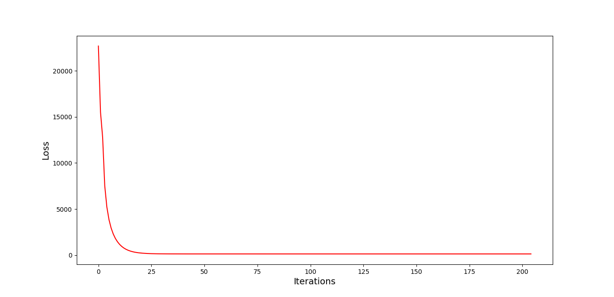

# ridgie

## Introduction

The fifth week's programming assignment for the UCSanDiego online course playing with the ridge regression models.

## Datasets

In this project we create our own dataset. A synthetic data set consisting of data points `(x, y)`:

- **x**: d-dimensional vector whose coordinates are independent draws from a standard normal (Gaussian) distribution
- **y**: response value given by `y = wx + e` where `w` is a target regression function and `e` is Gaussian noise

Here we will fix `w` to be the `100-dimensional` vector whose first ten coordinates are exactly 1.0, and whose remaining coordinates are zero. Thus only the first ten coordinates of `x` are relevant to the regression task.

But, the number of points, the dimension of `x` and the `1 coordinates` in `w` are variable in the `config.yaml` file.

### Processing methods

#### Algorithm

We use the gradient descent algorithm to fit our model to data and obtain the weights and intercept. In the learning procedure, we only update the weights when the resulting loss is smaller that the previous loss.

#### Loss Function

We use the standard ridge loss as below:

<div class="formula" style="
                background-color: white;
                padding: 15px;
                border-style: solid;
                border-color: gray;
                border-width: 5px;
                border-radius: 10px;">
</img>
</div>

#### Learning Rate

We have implemented an adaptive learning rate, that reduces in size only if the value of loss increases according to the following formula.

<div class="formula" style="
                background-color: white;
                padding: 15px;
                border-style: solid;
                border-color: gray;
                border-width: 5px;
                border-radius: 10px;">
</img>
</div>

#### Convergence

We consider it convergence when the value of the loss does not change much after an update. More accurately, if the last loss is less different from the previous loss than `4e-12`, we are convinced that the model has converged.

## Dependencies

This project uses Python 3.10.12 to run and for a list of requirements consult the requirements.txt list.

## Run

To run the project, configure the `conf.yaml`. Then run the entry point `main.py`. To get a list of programme arguments, run the entry point with argument `help`.

## Results

After running our manually written model, we got the following result:

```
Final Loss: 91.63993759168858
Intecept: -0.004044058913172736
```



Comparing our results with the built-in solver of the scikit-learn package:

```
MSE of gradient descent solver:  0.42871897704825024
MSE of built-in solver:  0.42871898226778654
Distance between w-coefficients:  7.511590490292842e-07
```
